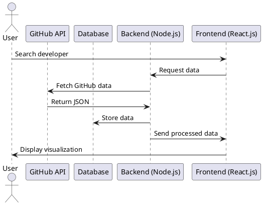

```md
# 🚀 GitConnectX: GitHub Network Analysis Platform


🔍 **GitConnectX** is a data-driven tool that analyzes GitHub’s developer ecosystem using **Graph Analysis & Network Science**. It applies **PageRank, BFS, DFS, Dijkstra’s Algorithm**, and **Louvain Clustering** to identify key developers and community structures.

---

## 📌 Features
✅ **Graph Visualization** – Interactive network graphs of developers & repositories  
✅ **Influence Analysis** – Identifies key developers via **PageRank & HITS**  
✅ **Community Detection** – Uses **Louvain Clustering** for grouping similar developers  
✅ **GitHub Data Extraction** – Fetches user-repository interactions via GitHub API  
✅ **Search & Filtering** – Explore developers & repositories dynamically  
✅ **RESTful API** – Provides endpoints for external tool integration  

---

## 🏗️ System Architecture



---

## ⚙️ Tech Stack
- **Languages**: Python, JavaScript  
- **Libraries**: PyGitHub, NetworkX, Pandas, NumPy, Matplotlib, D3.js  
- **Frameworks**: Flask/FastAPI, React.js  
- **Database**: PostgreSQL/MongoDB  
- **Deployment**: Docker, AWS/GCP  

---

## 📊 Algorithms Used (DAA & DS)
- **Graph Traversal**: BFS, DFS  
- **Shortest Path**: Dijkstra’s Algorithm  
- **Influence Ranking**: PageRank, HITS  
- **Community Detection**: Louvain Clustering  
- **Data Structures**: Graphs, Hash Maps, Adjacency Lists  

---

## 🛠️ Installation
```sh
# Clone the repository
git clone https://github.com/your-username/GitConnectX.git
cd GitConnectX

# Install dependencies
npm install       # For frontend
pip install -r requirements.txt   # For backend

# Start the backend
cd backend
python app.py

# Start the frontend
cd frontend
npm start
```

---

## 📖 References
1. L. Tang and H. Liu, *Community Detection in Social Networks*, Morgan & Claypool, 2010.  
2. S. Brin and L. Page, "The Anatomy of a Large-Scale Hypertextual Web Search Engine," *Computer Networks*, vol. 30, no. 1, pp. 107-117, 1998.  
3. M. Girvan and M. E. J. Newman, "Community Structure in Social and Biological Networks," *PNAS*, vol. 99, no. 12, pp. 7821-7826, 2002.  

---

## 👥 Who Are We?
**Team Ananta** – A group of passionate developers and researchers dedicated to exploring GitHub's network and providing valuable insights.  
### **Team Members:**
- **Ankush Rawat**  
- **Anika Dewari**  
- **Akhil Nautiyal**  
- **Ayush Negi**  

---

## 🌟 Contributing
Want to contribute? Follow our guidelines and submit a PR! 🚀

📧 **Contact**: ankurawat8844@gmail.com 
🔗 **GitHub**: [GitConnectX](https://github.com/your-username/GitConnectX)

---

**📌 License:** MIT 📜 | **🔗 Developed by**: Team Ananta  
```


